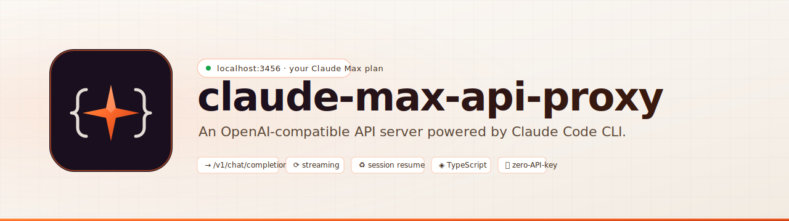

<div align="center">

<picture>
  <source media="(prefers-color-scheme: dark)" srcset="./assets/banner-dark.svg">
  
</picture>

<br/>

<pre>
[ CLAW PROXY // LOCALHOST RELAY // CLAUDE MAX ]
  CCCC   L         A      W     W    PPPP   RRRR    OOO   X   X  Y   Y
 C       L        A A     W     W    P   P  R   R  O   O   X X    Y Y
 C       L       AAAAA    W  W  W    PPPP   RRRR   O   O    X      Y
 C       L       A   A    W WWW W    P      R R    O   O   X X     Y
  CCCC   LLLLL   A   A     WW WW     P      R  RR   OOO   X   X    Y
</pre>

<p>
  <b>Claw Proxy</b> is the cyberpunk face of
  <code>claude-max-api-proxy</code>.
</p>

<p>
  <a href="#jack-in"></a>
  <a href="./LICENSE"></a>
  
  
  
  
  
  
</p>

<p>
  <b>Route any OpenAI-compatible client into your live Claude Max session.</b><br/>
  OpenAI on the edge. Claude Code CLI in the core. Localhost in between.
</p>

<p>
  <code>Continue.dev</code> / <code>Aider</code> / <code>OpenAI SDKs</code> / <code>curl</code>
  &rarr; <code>127.0.0.1:3456</code>
  &rarr; <code>Claw Proxy</code>
  &rarr; <code>authenticated claude CLI</code>
  &rarr; <code>Claude Max</code>
</p>

<p>
  <a href="#why-claw-proxy-exists">Why</a> ·
  <a href="#signal-grid">Signal Grid</a> ·
  <a href="#systems-online">Systems</a> ·
  <a href="#jack-in">Jack In</a> ·
  <a href="#plug-in-any-openai-client">Clients</a> ·
  <a href="./docs/API.md">API</a> ·
  <a href="./docs/CONFIGURATION.md">Config</a> ·
  <a href="./docs/ARCHITECTURE.md">Architecture</a> ·
  <a href="./docs/TROUBLESHOOTING.md">Troubleshooting</a>
</p>

</div>

---

## Why Claw Proxy Exists

You already have a working Claude Max session on your machine. Your local
`claude` CLI is authenticated. But the rest of the modern tooling ecosystem
keeps asking for an OpenAI-compatible `baseURL`.

That mismatch is the whole reason this project exists.

**Claw Proxy** is the product identity for this repo. The repository and
package stay named `claude-max-api-proxy`, but the thing you actually run is a
local bridge that speaks OpenAI on the outside and Claude Code CLI on the
inside.

Claw Proxy runs a local HTTP server on `127.0.0.1:3456`, accepts OpenAI-shaped
requests, invokes the authenticated Claude Code CLI underneath, and streams the
result back in the format your client already expects.

No separate Anthropic API key. No extra API bill. No Docker requirement. Just
your existing Claude Max session exposed behind a sharp, local, OpenAI-shaped
surface.

<table>
  <tr>
    <td width="33%" valign="top">
      <b>OUTER SHELL</b><br/>
      Keep your existing SDKs, editors, and agents. Change the base URL, not
      your workflow.
    </td>
    <td width="33%" valign="top">
      <b>INNER LINK</b><br/>
      Requests flow through the authenticated <code>claude</code> CLI, so the
      proxy rides the real local session you already use.
    </td>
    <td width="33%" valign="top">
      <b>MODEL SCAN</b><br/>
      Stable aliases stay simple while <code>/v1/models</code> publishes the
      exact model IDs your installed CLI resolves today.
    </td>
  </tr>
</table>

## Signal Grid

```text
[ OPENAI CLIENT ] ---> [ CLAW PROXY @ 127.0.0.1:3456 ] ---> [ CLAUDE CODE CLI ] ---> [ CLAUDE MAX ]
     SDKs / editors             chat + models + health            authenticated locally      your paid plan
     curl / agents              queue + session spine             dynamic model probes        no extra API key
```

## Systems Online

| Surface | Why it matters |
| --- | --- |
| OpenAI-compatible edge | `POST /v1/chat/completions`, `GET /v1/models`, and `GET /health`, with streaming and non-streaming support. |
| Zero extra credentials | Reuses the machine's existing `claude auth login` session instead of asking clients for a second API key. |
| Dynamic model routing | Probes stable families like `sonnet`, `opus`, and `haiku`, then surfaces the exact model IDs your local Claude CLI currently resolves. |
| Session continuity | Reuses the OpenAI `user` field as a conversation key and resumes the underlying CLI session automatically. |
| Operational discipline | Warm subprocess pool, per-family stall timeouts, kill escalation, structured logs, and a detailed `/health` snapshot. |
| Sensible deployment | Plain Node.js checkout first. Docker supported, but optional. macOS and Linux service docs included. |

## Jack In

You need **Node.js 22+**, **npm**, and the **Claude Code CLI** already logged
in.

```bash
# 1. Install Claude CLI and authenticate (skip if already installed)
npm install -g @anthropic-ai/claude-code
claude auth login

# 2. Clone, install, build, run
git clone https://github.com/mattschwen/claude-max-api-proxy.git
cd claude-max-api-proxy
npm install
npm run build
npm start
```

The proxy warms up by probing model availability against your authenticated CLI,
then binds to `http://127.0.0.1:3456`.

```bash
curl http://127.0.0.1:3456/health
curl http://127.0.0.1:3456/v1/models
```

> [!IMPORTANT]
> If `/v1/models` returns `{"object":"list","data":[]}`, the proxy started but
> your Claude CLI account cannot access any models right now. Fix auth first.
> See [docs/TROUBLESHOOTING.md](./docs/TROUBLESHOOTING.md).

> [!NOTE]
> Prefer containers? See [docs/docker-setup.md](./docs/docker-setup.md). Docker
> is supported, but not required.

## Plug In Any OpenAI Client

### Python

```python
from openai import OpenAI

client = OpenAI(
    base_url="http://127.0.0.1:3456/v1",
    api_key="ignored",
)

resp = client.chat.completions.create(
    model="sonnet",
    messages=[{"role": "user", "content": "Say hi in one word."}],
)

print(resp.choices[0].message.content)
```

### TypeScript

```typescript
import OpenAI from "openai";

const client = new OpenAI({
  baseURL: "http://127.0.0.1:3456/v1",
  apiKey: "ignored",
});

const resp = await client.chat.completions.create({
  model: "sonnet",
  messages: [{ role: "user", content: "Say hi in one word." }],
});

console.log(resp.choices[0].message.content);
```

### curl

```bash
curl -N http://127.0.0.1:3456/v1/chat/completions \
  -H "Content-Type: application/json" \
  -d '{
    "model": "sonnet",
    "stream": true,
    "messages": [
      { "role": "user", "content": "Write a haiku about local proxies." }
    ]
  }'
```

### Common client defaults

| Setting | Value |
| --- | --- |
| Base URL | `http://127.0.0.1:3456/v1` |
| API key | any non-empty string |
| Model | `sonnet`, `opus`, `haiku`, or an exact ID from `/v1/models` |

The proxy accepts stable family aliases and resolves them to whatever exact
version the installed Claude CLI currently exposes. `GET /v1/models` returns
those runtime-resolved IDs.

### Example client snippets

<details>
<summary><b>Continue.dev</b></summary>

```json
{
  "models": [
    {
      "title": "Claw Proxy",
      "provider": "openai",
      "model": "sonnet",
      "apiBase": "http://127.0.0.1:3456/v1",
      "apiKey": "local"
    }
  ]
}
```

</details>

<details>
<summary><b>OpenClaw</b></summary>

```json
{
  "providers": {
    "claw-proxy": {
      "baseUrl": "http://127.0.0.1:3456/v1",
      "api": "openai-completions",
      "auth": "api-key",
      "apiKey": "ignored",
      "models": [{ "id": "sonnet" }, { "id": "opus" }]
    }
  }
}
```

</details>

## Configuration

Everything is environment-variable driven. The full reference lives in
[docs/CONFIGURATION.md](./docs/CONFIGURATION.md).

```bash
# Cancel the in-flight request when a newer one lands for the same conversation
export CLAUDE_PROXY_SAME_CONVERSATION_POLICY=latest-wins

# Or: strict FIFO for each conversation key
export CLAUDE_PROXY_SAME_CONVERSATION_POLICY=queue

# Extra visibility into queue internals
export CLAUDE_PROXY_DEBUG_QUEUES=true

# Optional: enable the runtime thinking-budget admin endpoint
# export CLAUDE_PROXY_ENABLE_ADMIN_API=true

npm start
```

## Run It Like Infrastructure

- **macOS**: [docs/macos-setup.md](./docs/macos-setup.md)
- **Linux**: [docs/linux-systemd.md](./docs/linux-systemd.md)
- **Docker**: [docs/docker-setup.md](./docs/docker-setup.md)

## Documentation

| Document | What's inside |
| --- | --- |
| [docs/API.md](./docs/API.md) | Full endpoint reference, request and response shapes, and examples |
| [docs/CONFIGURATION.md](./docs/CONFIGURATION.md) | Environment variables, defaults, and runtime policies |
| [docs/ARCHITECTURE.md](./docs/ARCHITECTURE.md) | Process model, queues, sessions, probes, and logging |
| [docs/TROUBLESHOOTING.md](./docs/TROUBLESHOOTING.md) | Failure modes, diagnosis, and repair steps |
| [docs/macos-setup.md](./docs/macos-setup.md) | LaunchAgent setup for automatic startup on macOS |
| [docs/linux-systemd.md](./docs/linux-systemd.md) | systemd user-service setup on Linux |
| [docs/docker-setup.md](./docs/docker-setup.md) | Optional container deployment and Compose setup |
| [CONTRIBUTING.md](./CONTRIBUTING.md) | Dev setup, style, tests, and PR flow |
| [CODE_OF_CONDUCT.md](./CODE_OF_CONDUCT.md) | Community expectations |
| [SECURITY.md](./SECURITY.md) | Private vulnerability reporting |

## Compare the Options

| Capability | `Claw Proxy` | Direct Anthropic API | Claude Code CLI only |
| --- | :---: | :---: | :---: |
| Uses your Max plan | ✅ | ❌ | ✅ |
| OpenAI-compatible endpoints | ✅ | ❌ | ❌ |
| Streaming | ✅ | ✅ | ✅ |
| Session continuity | ✅ | Partial | ✅ |
| Works with Continue, Aider, SDKs | ✅ | Partial | ❌ |
| Requires separate API key | ❌ | ✅ | ❌ |
| Docker required | ❌ | ❌ | ❌ |

## Requirements

- **Node.js 22+**
- **npm**
- **[Claude Code CLI](https://github.com/anthropics/claude-code)** installed and authenticated
- A **Claude Max** or equivalent subscription with access to at least one Claude model

## Development

```bash
git clone https://github.com/mattschwen/claude-max-api-proxy.git
cd claude-max-api-proxy
npm install
npm run ci
npm start
```

Source lives in `src/`. Compiled output lives in `dist/` and is generated by
the TypeScript build. Tests live next to the source as `*.test.ts` and run from
their compiled `dist/**/*.test.js` output.

## Community

Issues and pull requests are welcome. Read
[CONTRIBUTING.md](./CONTRIBUTING.md) before opening a PR, use the issue
templates when they apply, and follow the expectations in
[CODE_OF_CONDUCT.md](./CODE_OF_CONDUCT.md).

## Security

The proxy binds to `127.0.0.1` by default and trusts the local Claude CLI
session. It does **not** authenticate clients. Anything that can reach `:3456`
can spend your Claude Max quota.

Keep it on localhost unless you deliberately place it behind real network
controls, and leave the optional admin API disabled unless you explicitly need
it. See [SECURITY.md](./SECURITY.md) for responsible disclosure.

## License

[MIT](./LICENSE)
