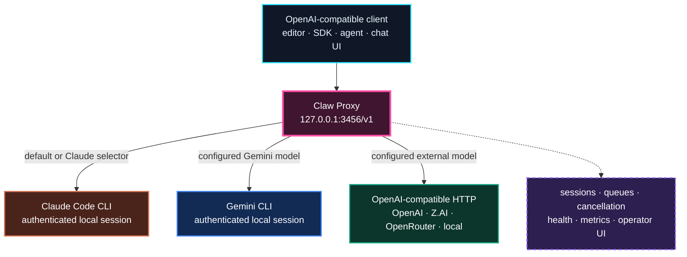

<div align="center">

<picture>
  <source media="(prefers-color-scheme: dark)" srcset="./assets/banner-dark.svg">
  
</picture>

**⚡ Use Claude Code, Gemini CLI, and OpenAI-compatible providers from the clients you already use.**

One local endpoint. Claude by default. Other providers only when you request
their configured model IDs.

<p>
  <a href="https://github.com/mattschwen/claude-max-api-proxy/stargazers"></a>
  <a href="https://github.com/mattschwen/claude-max-api-proxy/actions/workflows/ci.yml"></a>
  <a href="./LICENSE"></a>
  
  
</p>

<p>
  <a href="#quick-start"><b>⚡ Quick start</b></a>
  ·
  <a href="#compare-the-options"><b>⚖️ Compare</b></a>
  ·
  <a href="#client-integrations"><b>🧩 Client setup</b></a>
  ·
  <a href="./docs/reference/API.md"><b>🧬 API reference</b></a>
</p>

<sub>Continue · Aider · OpenAI SDKs · Open WebUI · curl · custom agents</sub>

</div>

---

Claw Proxy turns authenticated AI CLIs and configured model providers into a
local OpenAI-compatible service. Point an existing editor, SDK, agent, or chat
frontend at a new `baseURL`; keep the rest of your workflow.

<p align="center">
  
  
  
  
</p>

## 🧭 Why Claw Proxy

Most editors, agents, and SDKs already speak the OpenAI API. Claude Code and
Gemini CLI already know who you are. Claw Proxy connects those two sides
without making you rebuild your toolchain.

| | You already have | The mismatch | Claw Proxy adds |
| :---: | --- | --- | --- |
| 🔐 | An authenticated Claude Code or Gemini CLI session | 🧩 Your client asks for an OpenAI-compatible URL | 🌉 One local endpoint with explicit provider routing |
| 🎯 | Provider credentials and model IDs | 🧶 Every provider has different setup | 🛣️ One model catalog and one client configuration |
| 🧠 | Long-running agent workflows | 🔀 CLIs and API clients track state differently | ♻️ Durable conversations, queues, cancellation, and metrics |

<a id="quick-start"></a>

## ⚡ Quick Start

The default Claude route needs **Node.js 22+**, **npm**, and an authenticated
[Claude Code CLI](https://github.com/anthropics/claude-code) session.

```bash
# Authenticate Claude Code once
npm install -g @anthropic-ai/claude-code
claude auth login

# Install and run Claw Proxy
git clone https://github.com/mattschwen/claude-max-api-proxy.git
cd claude-max-api-proxy
npm ci
npm run build
npm start
```

Startup probes the models available to the local account before the server is
ready. Verify the runtime:

```bash
curl http://127.0.0.1:3456/health
curl http://127.0.0.1:3456/v1/models
```

Send the first request:

```bash
curl -N http://127.0.0.1:3456/v1/chat/completions \
  -H "Content-Type: application/json" \
  -d '{
    "model": "sonnet",
    "stream": true,
    "messages": [
      { "role": "user", "content": "Reply with: bridge online" }
    ]
  }'
```

### 🔌 Point a client at the proxy

| | Client setting | Value |
| :---: | --- | --- |
| 🌐 | **Base URL** | `http://127.0.0.1:3456/v1` |
| 🔑 | **API key** | Any non-empty string if the client requires one |
| 🧠 | **Model** | `sonnet`, `opus`, `best`, `fable`, `haiku`, or `default` |

<details>
<summary><b>OpenAI Python SDK</b></summary>

```python
from openai import OpenAI

client = OpenAI(
    base_url="http://127.0.0.1:3456/v1",
    api_key="local",
)

response = client.chat.completions.create(
    model="sonnet",
    messages=[{"role": "user", "content": "Reply with: bridge online"}],
)

print(response.choices[0].message.content)
```

</details>

<details>
<summary><b>OpenAI TypeScript SDK</b></summary>

```typescript
import OpenAI from "openai";

const client = new OpenAI({
  baseURL: "http://127.0.0.1:3456/v1",
  apiKey: "local",
});

const response = await client.chat.completions.create({
  model: "sonnet",
  messages: [{ role: "user", content: "Reply with: bridge online" }],
});

console.log(response.choices[0].message.content);
```

</details>

## 🛰️ How Routing Works


```mermaid
flowchart TB
    Client["OpenAI-compatible client<br/>editor · SDK · agent · chat UI"]
    Proxy["Claw Proxy<br/>127.0.0.1:3456/v1"]
    Claude["Claude Code CLI<br/>authenticated local session"]
    Gemini["Gemini CLI<br/>authenticated local session"]
    External["OpenAI-compatible HTTP<br/>OpenAI · Z.AI · OpenRouter · local"]
    Runtime["sessions · queues · cancellation<br/>health · metrics · operator UI"]

    Client --> Proxy
    Proxy -->|"default or Claude selector"| Claude
    Proxy -->|"configured Gemini model"| Gemini
    Proxy -->|"configured external model"| External
    Proxy -.-> Runtime

    classDef client fill:#101828,stroke:#2fe6ff,color:#ebf7ff,stroke-width:2px;
    classDef proxy fill:#40152f,stroke:#ff4fa8,color:#ffffff,stroke-width:3px;
    classDef claude fill:#4a241b,stroke:#d97757,color:#ffffff,stroke-width:2px;
    classDef gemini fill:#122b55,stroke:#4285f4,color:#ffffff,stroke-width:2px;
    classDef external fill:#0c352b,stroke:#10a37f,color:#ffffff,stroke-width:2px;
    classDef runtime fill:#2d1f50,stroke:#9a6bff,color:#ffffff,stroke-width:2px,stroke-dasharray:5 5;

    class Client client;
    class Proxy proxy;
    class Claude claude;
    class Gemini gemini;
    class External external;
    class Runtime runtime;
```

> [!TIP]
> **📡 Signal rule:** Claude is implicit; every other provider is explicit.

| Requested model | Effective route |
| --- | --- |
| Omitted or `default` |  Account-tier default |
| `sonnet`, `opus`, `best`, `fable`, `haiku` |  Family selector; `best` follows Opus |
| `sonnet[1m]`, `opus[1m]`, or a supported full ID with `[1m]` |  Extended-context selector with entitlement check |
| Exact Claude ID from `/v1/models` |  Runtime-resolved Claude model |
| Configured Gemini model ID |  Matching explicit Gemini CLI or API provider |
| Configured GLM, OpenAI, local, or other model ID |  Matching explicit provider |

External models never silently replace Claude. If the Claude path is
unavailable, a Claude-default request returns a Claude error instead of
quietly sending the prompt elsewhere.

## 🧰 What You Get

- 🔌 **Keep your toolchain.** Continue, Aider, Open WebUI, OpenAI SDKs, `curl`,
  and custom agents only need a new base URL.
- 🔐 **Reuse authenticated CLIs.** Route through local Claude Code or Gemini CLI
  sessions without adding a provider API key for those paths.
- 🌊 **Use OpenAI-shaped interfaces.** Stream Chat Completions or use the
  non-streaming Responses compatibility surface.
- 📡 **Runtime model discovery.** `/v1/models` reports the Claude IDs the installed
  CLI can actually use alongside configured external models.
- 🧵 **Durable conversations.** Stable conversation IDs, committed checkpoints,
  idempotent non-streaming retries, and branchable Responses continuations
  survive process restarts.
- ⚡ **Safe concurrency.** Independent conversations run in parallel; each
  conversation can use interrupt-style `latest-wins` or FIFO queueing.
- 🎛️ **Operational control.** Cancel queued or active work, inspect health and
  capabilities, scrape Prometheus metrics, and use the built-in operator UI.
- 🤖 **Agent-ready discovery.** Capability metadata describes available models,
  reasoning inputs, provider state, and the built-in `expert-coder` profile.

<a id="compare-the-options"></a>

## ⚖️ Compare the Options

This comparison is for connecting OpenAI-compatible developer tools to the
providers and authenticated CLIs you already use.

| Capability | Claw Proxy | Direct provider API | CLI alone |
| --- | :---: | :---: | :---: |
| One OpenAI-compatible base URL |  |  |  |
| Reuse Claude Code or Gemini CLI login |  |  |  |
| Route multiple providers by model ID |  |  |  |
| Streaming Chat Completions |  |  |  |
| Responses API compatibility |  |  |  |
| Durable conversation routing |  |  |  |
| Health, metrics, cancellation, and operator UI |  |  |  |
| Docker required |  |  |  |

## 🧬 API Surface

| Surface | Status |
| --- | --- |
|  `/v1/chat/completions` | 🌊 Streaming and non-streaming OpenAI-compatible chat |
|  `/v1/responses` | 🧵 Non-streaming input, instructions, and continuation |
|  `/v1/models` | 📡 Runtime-resolved Claude models and configured external models |
|  `/v1/capabilities` | 🧠 Model, provider, reasoning, and CLI feature discovery |
|  `/v1/agents` | 🤖 Built-in agent catalog and scoped agent routes |
|  `/v1/requests/:requestId` | 🛑 Cancellation for queued or active requests |
|  `/health` · `/metrics` | 💚 Readiness, runtime state, and Prometheus telemetry |
|  `/` · `/ops` · `/launch` | 🖥️ Operator dashboard and multi-thread Chat Lab |

See the [full API reference](./docs/reference/API.md) for request shapes,
response headers, reasoning controls, conversation identity, idempotency, and
error codes.

> [!IMPORTANT]
> An empty `/v1/models` response is a real availability signal. It means no
> Claude model passed its runtime probe and no external model is configured.
> Check `claude auth status`, `/health.models.unavailable`, and the
> [troubleshooting guide](./docs/reference/TROUBLESHOOTING.md).

## 🔌 Connect a Provider

### 🧡 Claude Code CLI — default

Claw Proxy does not require an Anthropic API key for this route. It launches
the locally authenticated `claude` CLI and preserves committed CLI sessions
across turns.

```bash
claude auth login
npm start
```

### 🔷 Gemini CLI — explicit

Use a local authenticated Gemini CLI session without a hosted API key:

```bash
export GEMINI_CLI_ENABLED=true
# `auto` lets the installed Gemini CLI select a currently available model.
export GEMINI_CLI_MODEL=auto
npm start
```

Request `auto` to use that route. To expose specific models instead, set
`GEMINI_CLI_MODEL` and `GEMINI_CLI_EXTRA_MODELS` to IDs supported by your
installed CLI. Google recommends the CLI's
[`auto` model selection](https://github.com/google-gemini/gemini-cli/blob/main/docs/cli/model.md)
because model availability changes over time.

### 🟢 OpenAI-compatible HTTP — explicit

OpenAI itself and any service with a compatible Chat Completions endpoint can
be registered as an explicit provider:

```bash
export OPENAI_COMPAT_FALLBACK_PROVIDER=openai
export OPENAI_COMPAT_FALLBACK_BASE_URL=https://api.openai.com/v1
export OPENAI_COMPAT_FALLBACK_API_KEY=your-api-key
export OPENAI_COMPAT_FALLBACK_MODEL=your-current-model-id
npm start
```

Shortcuts are included for Google AI Studio (`GEMINI_API_KEY`) and Z.AI
(`ZAI_API_KEY`). For multiple providers, per-model upstream IDs, custom
headers, timeouts, and capability metadata, use
`OPENAI_COMPAT_PROVIDERS_JSON`.

[Provider configuration →](./docs/reference/CONFIGURATION.md#external-openai-compatible-provider)

<a id="client-integrations"></a>

## 🧩 Client Integrations

Use the same connection details everywhere; choose a model from
`GET /v1/models` instead of copying an ID from an old example.

| Client | Provider type | Base URL | API key |
| --- | --- | --- | --- |
| 🧠 **Continue** |  | `http://127.0.0.1:3456/v1` | 🔑 Any non-empty value |
| 🛠️ **Aider** |  | `http://127.0.0.1:3456/v1` | 🔑 Any non-empty value |
| 🖥️ **Open WebUI** |  | `http://host.docker.internal:3456/v1` from Docker | 🔑 Any non-empty value |
| 🐍 **Python SDK** · 🟦 **TypeScript SDK** |  | `http://127.0.0.1:3456/v1` | 🔑 Any non-empty value |
| 🤖 **Custom agents** |  | `http://127.0.0.1:3456/v1` | 🔑 Any non-empty value |

<details>
<summary><b>🧠 Continue configuration</b></summary>

```yaml
name: Claw Proxy
version: 1.0.0
schema: v1

models:
  - name: Claw Proxy
    provider: openai
    model: sonnet
    apiBase: http://127.0.0.1:3456/v1
    apiKey: local
```

</details>

<details>
<summary><b>🦞 OpenClaw configuration</b></summary>

```json
{
  "models": {
    "providers": {
      "claw-proxy": {
        "baseUrl": "http://127.0.0.1:3456/v1",
        "apiKey": "local",
        "api": "openai-completions",
        "models": [
          {
            "id": "sonnet",
            "name": "Claw Proxy · Sonnet"
          }
        ]
      }
    }
  }
}
```

</details>

### 🤖 Built-in expert agent

`expert-coder` is a discoverable, repository-aware coding profile exposed by
`GET /v1/agents`. Request it through `/v1/agents/expert-coder/chat/completions`,
or make it the default for every request:

```bash
export CLAUDE_PROXY_DEFAULT_AGENT=expert-coder
npm start
```

## 🧵 Conversations, Queues, and Cancellation

Set `conversation_id` when a client needs a durable thread:

```json
{
  "model": "sonnet",
  "conversation_id": "project-42",
  "messages": [
    { "role": "user", "content": "Continue the implementation." }
  ]
}
```

Every accepted request returns `X-Request-Id` and `X-Conversation-Id`.
Use the request ID to cancel work:

```bash
curl -X DELETE http://127.0.0.1:3456/v1/requests/REQUEST_ID
```

The default same-conversation policy is `latest-wins`. Set
`CLAUDE_PROXY_SAME_CONVERSATION_POLICY=queue` for FIFO, or choose
`interrupt` / `queue` per request. Independent conversation IDs run
concurrently up to `CLAUDE_PROXY_MAX_CONCURRENT_REQUESTS`.

## 🖥️ Operator Surfaces

Run the proxy on the host, then open:

| Surface | URL |
| --- | --- |
| 🎛️ **Command deck** | `http://127.0.0.1:3456/` |
| 📊 **Dashboard alias** | `http://127.0.0.1:3456/ops` |
| 🧪 **Multi-thread Chat Lab** | `http://127.0.0.1:3456/launch` |
| 📡 **Structured metrics** | `http://127.0.0.1:3456/metrics?format=json` |

The command deck exposes queue pressure, throughput, latency, sessions,
subprocesses, model state, recent conversations, and structured logs. Chat Lab
supports independent thread tabs, transcript branching, and per-thread
interrupt or FIFO behavior.

Open WebUI is optional:

```bash
# The host proxy must be reachable from Docker.
HOST=0.0.0.0 CLAUDE_PROXY_LOG_FILE=logs/proxy.jsonl npm start

# In another shell:
docker compose up -d open-webui
```

Open WebUI will be available at `http://127.0.0.1:8080/`.

## 🎛️ Configuration Essentials

| Variable | Default | Purpose |
| --- | --- | --- |
| `CLAUDE_PROXY_SAME_CONVERSATION_POLICY` |  | ⚡ Interrupt or queue same-thread work |
| `CLAUDE_PROXY_MAX_CONCURRENT_REQUESTS` |  `2`–`8` | 🛣️ Limit concurrent independent conversations |
| `CLAUDE_PROXY_MODEL_FALLBACKS` |  | 🪜 Ordered Claude-only fallback selectors |
| `CLAUDE_PROXY_REQUIRE_CLAUDE` |  | 🧡 Require Claude even when external providers exist |
| `CLAUDE_PROXY_DEFAULT_AGENT` |  | 🤖 Apply `expert-coder` to every request |
| `CLAUDE_PROXY_SYSTEM_PROMPT_FILE` |  | 📜 Prepend a reloadable house prompt |
| `CLAUDE_PROXY_LOG_FILE` |  | 📝 Append structured JSON logs to a file |
| `CLAUDE_PROXY_ENABLE_ADMIN_API` |  | 🔐 Mount protected runtime controls |

All configuration is environment-variable driven. See the
[complete configuration reference](./docs/reference/CONFIGURATION.md).

## 🚀 Deployment

| Target | Guide |
| --- | --- |
| 🍎 **macOS LaunchAgent** | [Automatic startup with user-keychain access](./docs/setup/macos-setup.md) |
| 🐧 **Linux systemd** | [User-service installation](./docs/setup/linux-systemd.md) |
| 🐳 **Docker / Compose** | [Host-proxy and fully containerized options](./docs/setup/docker-setup.md) |

For long-running deployments, persist `DB_PATH`, `SESSION_FILE`, and
`RUNTIME_STATE_FILE`; set `CLAUDE_PROXY_LOG_FILE`; probe `/health`; scrape
`/metrics`; and keep the service behind trusted network controls.

## 📚 Documentation

| Document | Use it for |
| --- | --- |
| 🧬 [**API reference**](./docs/reference/API.md) | Endpoints, payloads, headers, errors, and examples |
| 🎛️ [**Configuration**](./docs/reference/CONFIGURATION.md) | Every environment variable and runtime policy |
| 🏗️ [**Architecture**](./docs/reference/ARCHITECTURE.md) | Routing, queues, sessions, subprocesses, and startup |
| 🗺️ [**Codebase index**](./docs/reference/CODEBASE_INDEX.md) | Contributor map and change hotspots |
| 🩺 [**Troubleshooting**](./docs/reference/TROUBLESHOOTING.md) | Startup, auth, model, stream, and queue failures |
| 🫶 [**Contributing**](./docs/community/CONTRIBUTING.md) | Development workflow, tests, and pull requests |
| 🛡️ [**Security policy**](./docs/community/SECURITY.md) | Threat model and private vulnerability reporting |

## ✅ Compatibility and Requirements

- 🟢 Node.js **22 or newer**
- 🟢 npm
- 🧡 For the default route: authenticated Claude Code CLI access to at least one
  Claude model
- 🔷 For the Gemini CLI route: an authenticated local Gemini CLI
- 🟢 For HTTP providers: a compatible base URL, model ID, and any required
  credentials

Claw Proxy implements the OpenAI surfaces documented above; it is not a
complete reimplementation of every OpenAI API. In particular, Responses
streaming is not currently supported. Query `/v1/capabilities` instead of
assuming optional features.

## 🛠️ Development

```bash
npm ci
npm run ci
npm start
```

Source lives in `src/`. TypeScript builds to `dist/`; tests live beside source
files as `*.test.ts` and run from their compiled `dist/**/*.test.js` output.

## 🛡️ Security

The proxy binds to `127.0.0.1` by default and does **not** authenticate normal
inference, diagnostic, or cancellation requests. Anything that can reach the
service can spend configured provider quota, inspect operational diagnostics,
or cancel a request if it obtains that request's opaque ID.

Keep it on localhost unless you place authentication and network controls in
front of it. Leave the optional admin API disabled unless needed, and use
`CLAUDE_PROXY_ADMIN_TOKEN` when enabling it beyond loopback. Provider plans,
usage limits, and terms still apply.

See the [security policy](./docs/community/SECURITY.md) for responsible
disclosure.

## 🌟 Community

Issues and pull requests are welcome. Read the
[contribution guide](./docs/community/CONTRIBUTING.md) and
[code of conduct](./docs/community/CODE_OF_CONDUCT.md) before participating.

If Claw Proxy removes an integration layer from your stack,
[star the repository](https://github.com/mattschwen/claude-max-api-proxy) so
other indie developers can find it.

## 📜 License

[MIT](./LICENSE)
